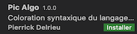

# Fonctionnalités 
Cette extension permet la **coloration syntaxique** du language algorithmique. Elle génére également automatiquement des **blocs de syntaxe** (exemple : strcuture d'une fonction ... cf. : fiche de syntaxe algo).

Les fonctionnalités seront activées automatiquement sur n'importe quel fichier avec l'extension `.algo` ou `.alg`.

Pour activer les fonctionnalités sur une autre extension (exemple : .txt ...), Cliquer sur `Texte brut` en bas à droite de la fenetre VSCode et remplacer par `Algorithmie`.
 
### **Fiche de syntaxe algorithmique**
https://github.com/pierrickdelrieu/Extension-Algo-VSC/blob/master/Syntaxe%20algorithmie%20-%20PicAlgo.pdf

# Installation
## Méthode 1
* Allez dans Visual Studio Code
* Tapez sur mac ⌘⇧P (sur windows : ctrl+p )
* Collez `ext install pierrickdelrieu.pic-algo`
* Saisissez entrez

## Méthode 2
* Allez dans Visual Studio Code
* Cliquez sur le bouton extension sur la barre latérale .
- Cherchez `Pic Algo` et cliquer sur cette extension :  .
- Il suffit ensuite de cliquer sur .

**L'extension est desormais installé** 

# Bugs
En cas de bug, n'hesitez pas à me le faire parvenir par mail : pierrick.delrieu@efrei.net.

 
# Node de version
cf. Journal de Version.  

**0.0.1** : Première version de l'extension avec initialisation de la langue et des blocs de code.

# A propos
Etudiant à Efrei Paris (Ecole d'ingénieur du numérique). Projet de programmation personnel lors de ma 2ème année d'étude.